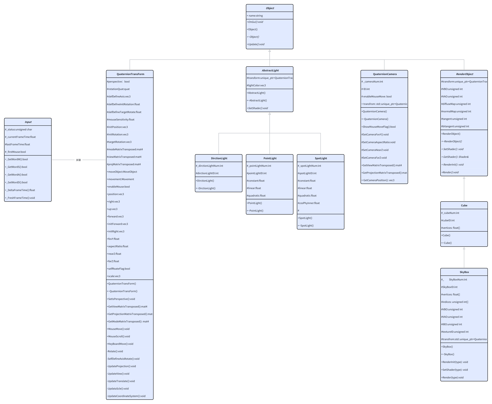
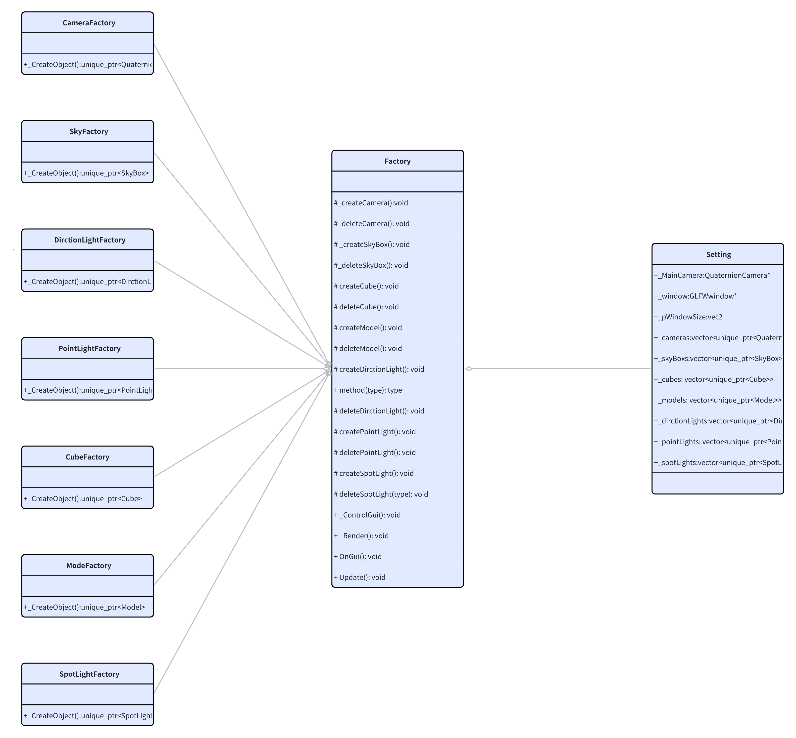

# MyEngine_OpenGL
OpenGL实现简单的渲染引擎

# 项目总体架构

QuaternionTransForm：中抽象封装了，绘制物体与摄像机的坐标系统，内部采用四元数实现，可实现绘制物体的旋转（自体旋转，自定义转轴旋转）、位移、缩放，摄像机的的视角缩放，自定义远近平面，旋转等功能。
光源：定义抽象光源类型，并派生平行光，点光源，聚光源三种类型，可自定义每种光源的属性，如光源颜色，方向，衰减系数等。
摄像机类：实现摄像机的旋转，视角变换，提供View矩阵与Projection矩阵。
绘制对象：设计RenderObject抽象类，提供派生类通用属性与方法(如：顶点数组缓冲对象VAO、顶点缓冲对象VBO、纹理属性、位移缩放、绘制等)，并派生立方体，天空盒子。其中立方体使用顶点数组直接绘制，天空盒子使用顶点索引进行绘制（当然，尽量采用顶点索引数据绘制可提高资源复用率）。
着色器类：将输入的glsl文件编译链接成着色器程序，简化着色器使用方式。
模型到如与绘制：由Model类与Mesh类构成 内部封装使用Assimp库，加载模型数据，并提供GUI界面操控模型位移、缩放、旋转、绘制等。
外部设置响应系统：设计Input抽象类，提供对鼠标与键盘事件的响应，目前仅设计对摄像机有响应事件响应。
工厂：工厂主要负责对各个元素的生成更新与GUI显示，简化对各个对象的控制操作，点击对应add按钮即可生成相应对象。详细架构参考架构图。
窗口：设计Window类型简化glfw窗口生成操作，并提供获取窗口指针的等实用方法。  

 