# MyEngine_OpenGL
OpenGL实现简单的渲染引擎

# 项目总体架构
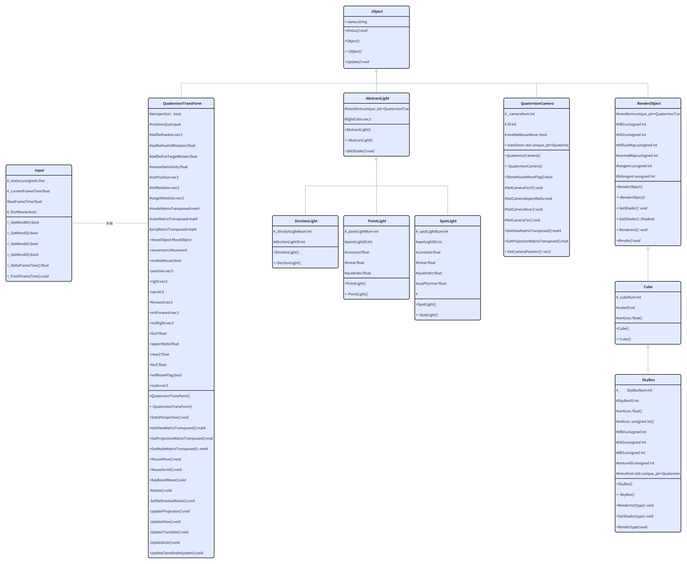

 
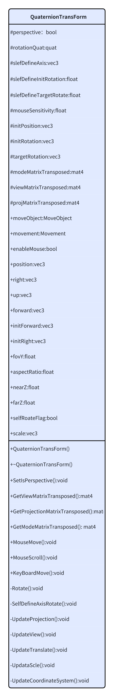

QuaternionTransForm：中抽象封装了，绘制物体与摄像机的坐标系统，内部采用四元数实现，可实现绘制物体的旋转（自体旋转，自定义转轴旋转）、位移、缩放，摄像机的的视角缩放，自定义远近平面，旋转等功能。

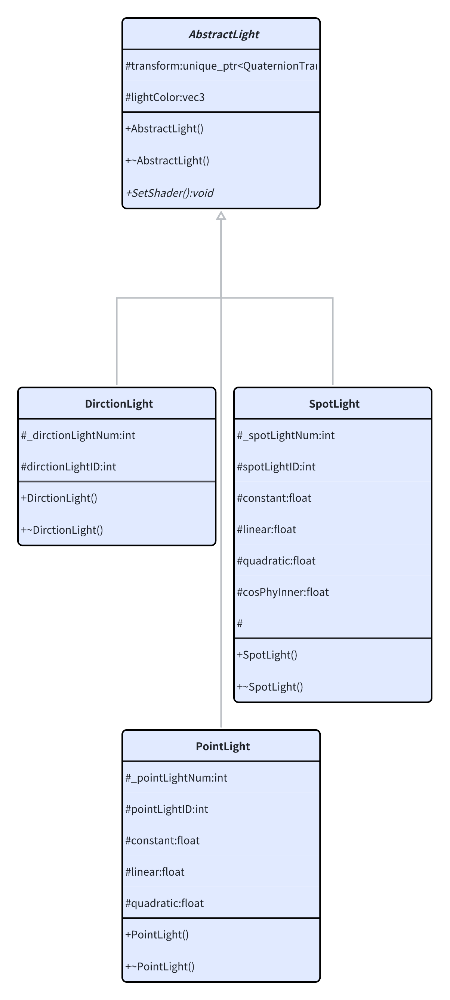

光源：定义抽象光源类型，并派生平行光，点光源，聚光源三种类型，可自定义每种光源的属性，如光源颜色，方向，衰减系数等。

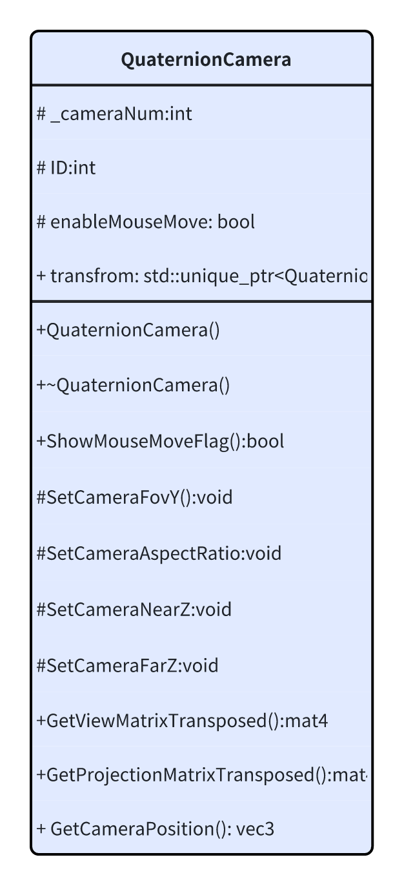

摄像机类：实现摄像机的旋转，视角变换，提供View矩阵与Projection矩阵。
 
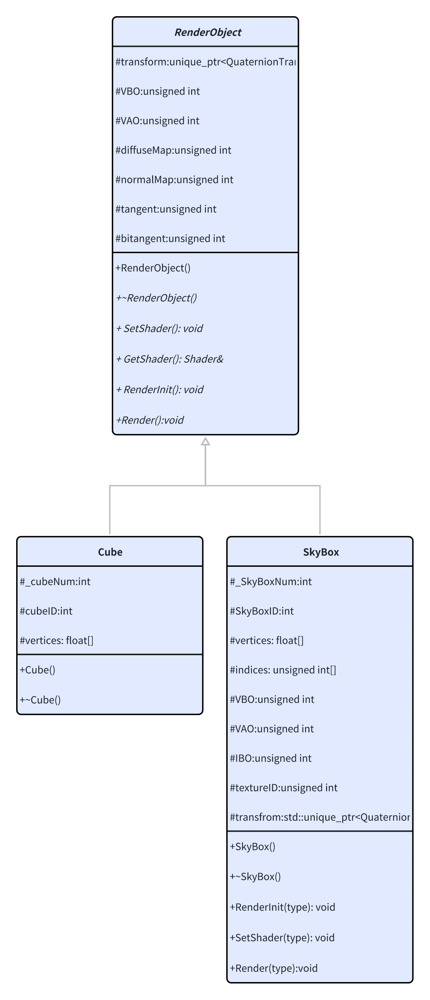

绘制对象：设计RenderObject抽象类，提供派生类通用属性与方法(如：顶点数组缓冲对象VAO、顶点缓冲对象VBO、纹理属性、位移缩放、绘制等)，并派生立方体，天空盒子。其中立方体使用顶点数组直接绘制，天空盒子使用顶点索引进行绘制（当然，尽量采用顶点索引数据绘制可提高资源复用率）。

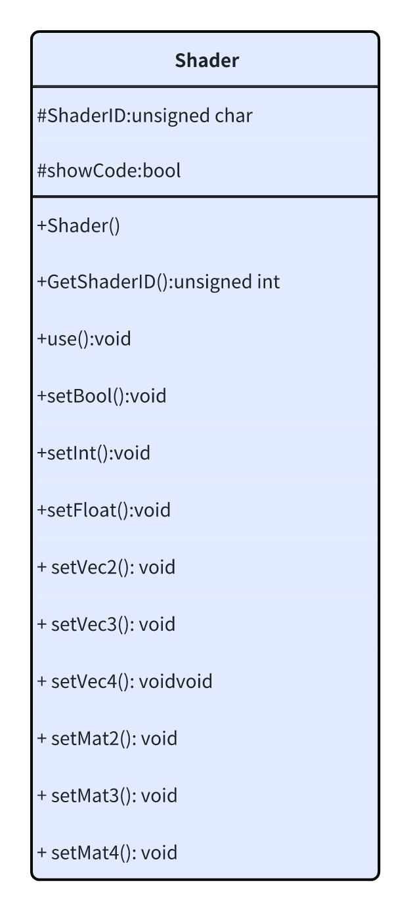

着色器类：将输入的glsl文件编译链接成着色器程序，简化着色器使用方式。

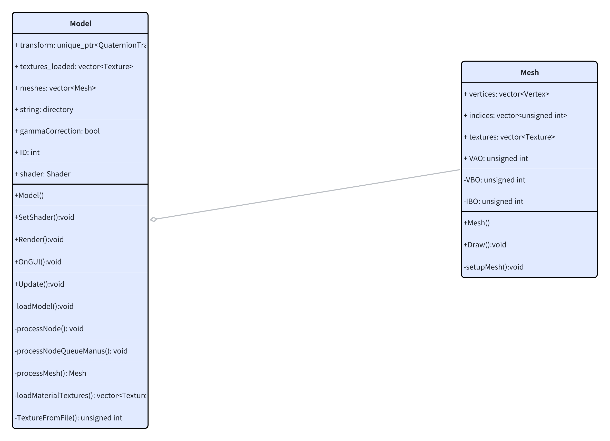

模型到如与绘制：由Model类与Mesh类构成 内部封装使用Assimp库，加载模型数据，并提供GUI界面操控模型位移、缩放、旋转、绘制等。

外部设置响应系统：设计Input抽象类，提供对鼠标与键盘事件的响应，目前仅设计对摄像机有响应事件响应。

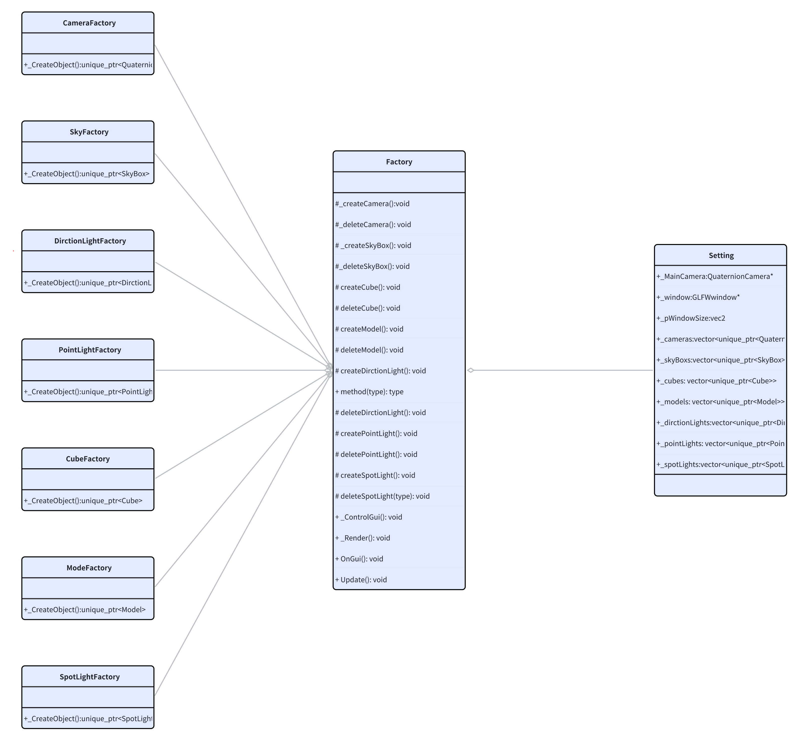

工厂：工厂主要负责对各个元素的生成更新与GUI显示，简化对各个对象的控制操作，点击对应add按钮即可生成相应对象。详细架构参考架构图。

窗口：设计Window类型简化glfw窗口生成操作，并提供获取窗口指针的等实用方法。  

# imGui

# 操作演示
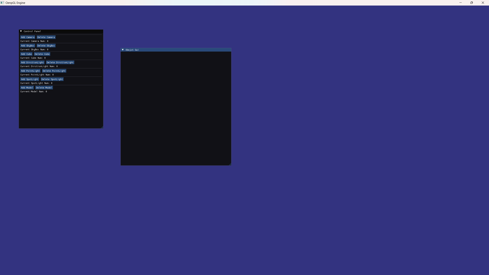

面板分为Control Panel 与 Object Gui : Control Panel主要用于生成摄像机，添加绘制物体，与光源，Object Gui用于控制Control Panel中生成对象的相关属性，例如位移旋转属性，光的颜色等属性。

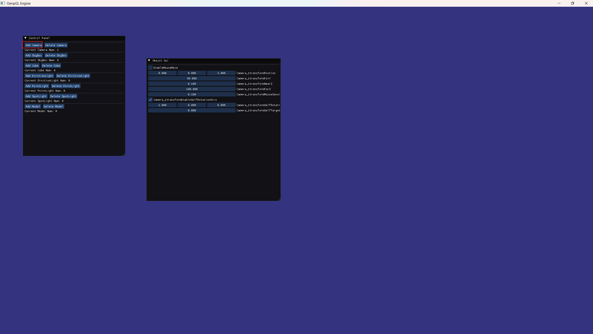

点击Add Camera即可生成一个摄像机，点击Delete Camera为删除最新添加的Camera(内部使用vector 动态数组维护Control Panel 中的对象生存管理)

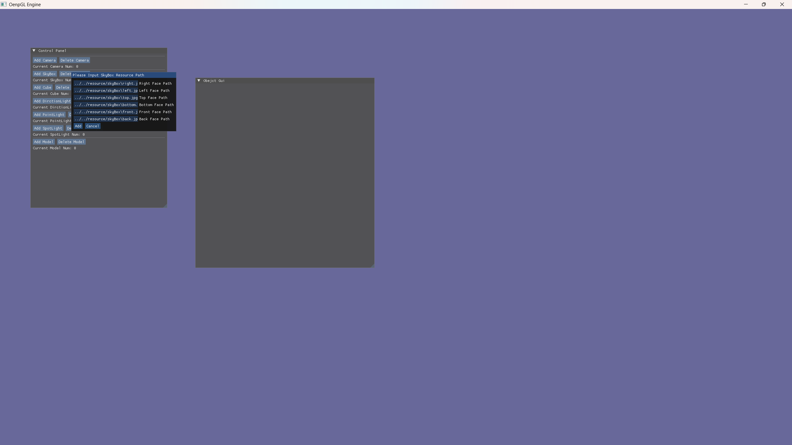

点击Add SkyBox将会弹出ImGui的模态窗口(弹窗出现会禁用背部空间)，配置SkyBox的纹理位置。

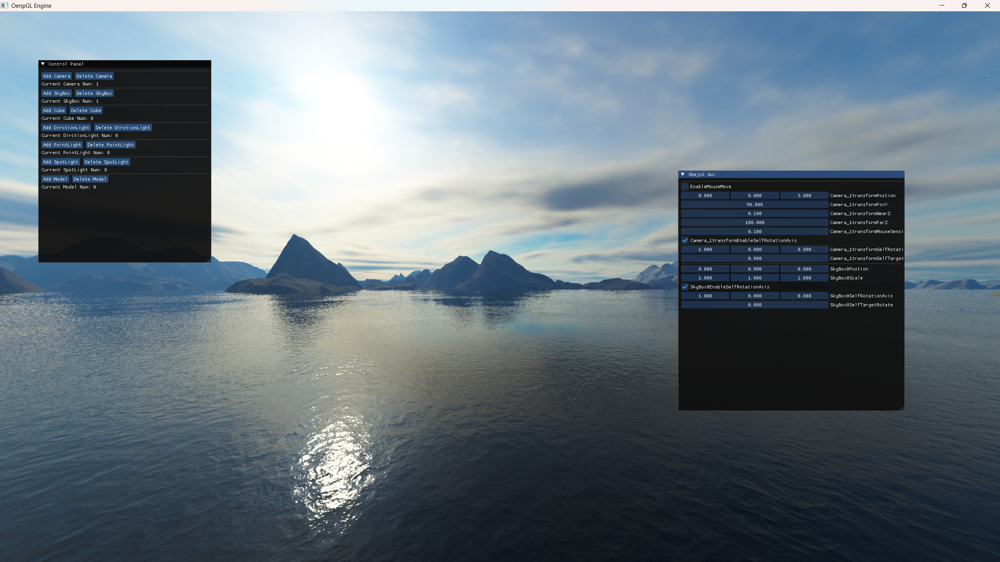

继续点击Add按钮即可生成天空盒子

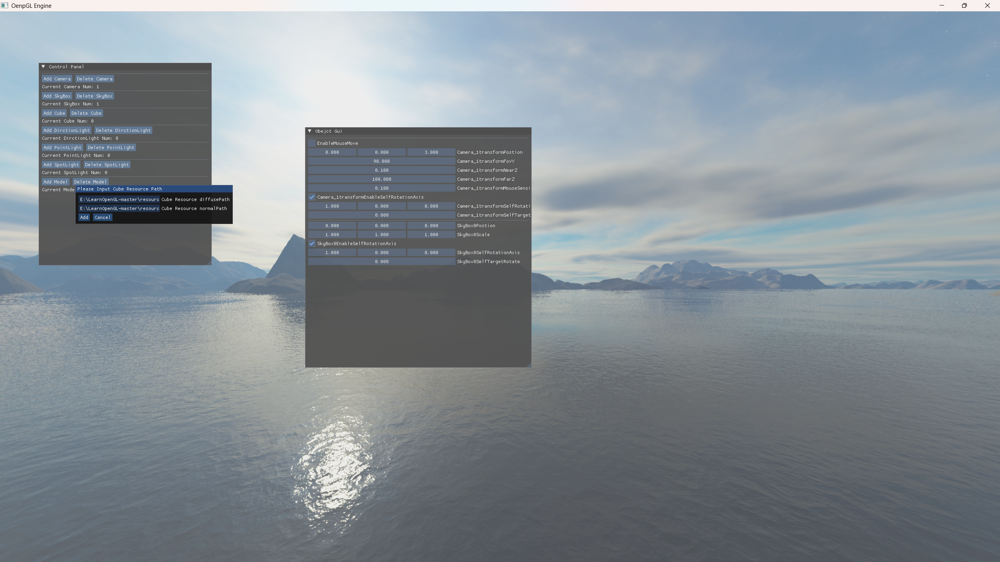

点击Add Cube 将会弹出模态窗口选择Cube纹理，继续点击Add按钮即可生成Cube对象，但是此时并没有添加光源，因此此时Cube对象显示为黑色(shader中并未设置Cube对象的环境光)

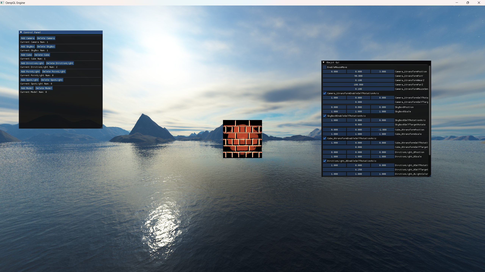

点击Add DirectLight 即可生成平行光源，同理可生成点光源与聚光源。

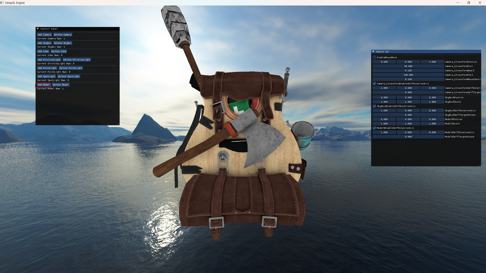

点击Add Model 将会弹出模态窗口，选择模型文件，继续点击Add即可生成model

# 视屏演示
<video controls src="markdownResource/demo.mp4" title="Title"></video>

